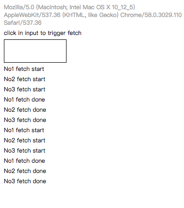
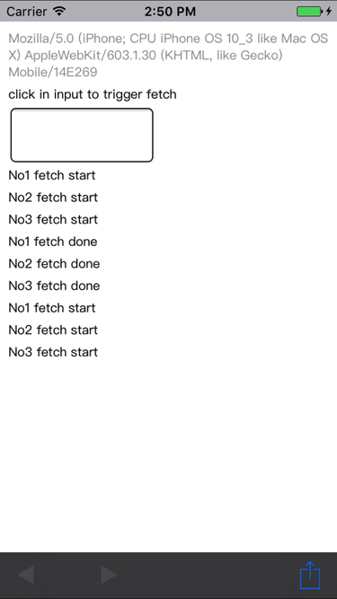

# UIWebView-BUG-fetch-silence-when-foucs

## summery

In UIWebView, fetch is buggy inside onfocus, it may just be silent and call neither callback.

## demo

open demo page : [https://weiying-shenzhen.github.io/UIWebview-BUG-fetch-silence-when-foucs/](https://weiying-shenzhen.github.io/UIWebview-BUG-fetch-silence-when-foucs/) ,

( [source code link here](https://github.com/weiying-shenzhen/UIWebview-BUG-fetch-silence-when-foucs/blob/master/index.html) )

focus on input, and blur

and do above line again

results:

| chrome  | ios UIWebView |
| ------------- | ------------- |
|   |  |

clearly ios UIWebView is lack of 3 done log after second focus. (no error log either)

the 3 fetch at second focus seem just silent after start, neither success nor error callback is triggered.

## environment

iOS 10.3, 10.3.1 and 10.3.2, earlier version not tested.

## P.S.

Not occurs on WKWebView

=====================================================================
##发现过程

发现手Q在输入框 focus 时调用原生 fetch 获取数据，有大概率会出现数据返回但没有触发 fetch 回调的情况

后经过对比和其他程序测试，认为是UIWebview的bug

### 复现环境
IOS版本：10.3.1
手Q版本：v7.0.1.407

### 复现步骤
1. 使用手Q打开[示例页面](https://weiying-shenzhen.github.io/UIWebview-BUG-fetch-silence-when-foucs/)
2. 点击页面的输入框触发 focus 和 fetch
3. 符合复现环境的机型，会停留在 fetch start，但后端数据其实已经返回了
